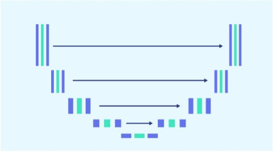
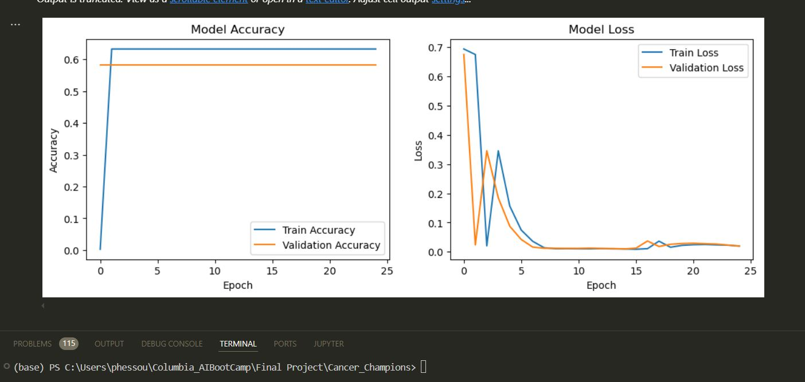
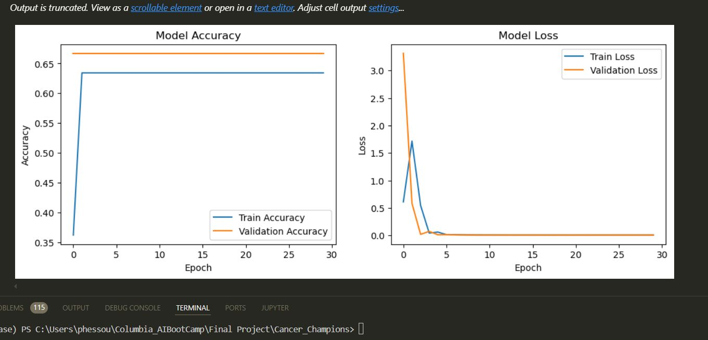
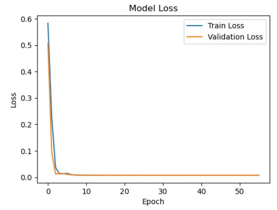
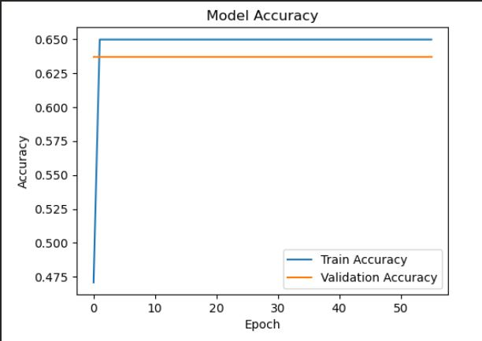
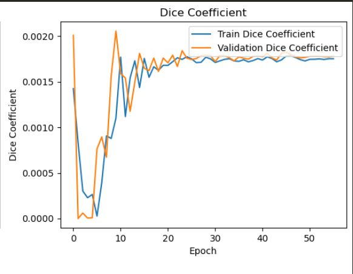
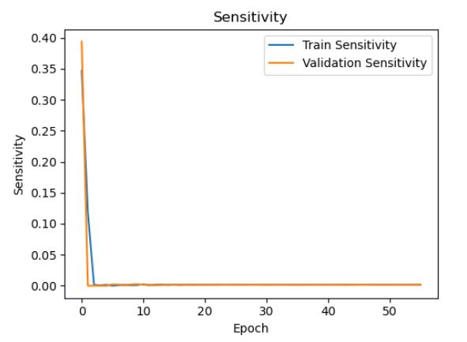
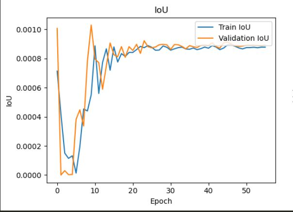

## Abstract
	There is large consent that successful training of deep networks requires many thousand annotated training samples. In this project, we present a network (U-Net) model. U-NET is a neural network model dedicated to Computer Vision tasks and more particularly to Semantic Segmentation problems. It is a widely used deep learning architecture that was first introduced in the “U-Net: Convolutional Networks for Biomedical Image Segmentation” paper. The primary purpose of this architecture was to address the challenge of limited annotated data in the medical field. This network was designed to effectively leverage a smaller amount of data while maintaining speed and accuracy. In a nutshell, U-Net works as follows:
      •	It uses a contracting path to downsample the image features.
      •	Upsamples the features using an expansive path.
      •	Concatenates features from the downsampling process during upsampling.  
  The contracting and expansive paths mirror each other. The name U-Net comes from the shape of the network, which forms a U-shape.
  Training and evaluation procedures include data splitting into training, validation, and test sets, with strategies to address class imbalance and overfitting. Evaluation metrics such as Dice coefficient, Intersection over Union (IoU), accuracy, sensitivity, and specificity are used to assess model performance, complemented by rigorous cross-validation and independent testing to ensure reliability.
  Compliance with data privacy regulations such as HIPAA or GDPR is essential, alongside addressing ethical considerations related to the use of medical data and maintaining transparency in model predictions. This framework provides a structured approach to developing a robust lung cancer image processing system, ensuring technical excellence and ethical integrity.

## Project3-Group 5: Cancer_Champions

## Group Members
* Tabibzadeh, Oliver
* Hessou, S. Prudence
* Dai, Xiwu
* Shen, Zhongzhe
* Qayyum, Wassam

## Project Overview
This project focuses on leveraging deep learning for the segmentation of lung cancer images using the U-Net architecture, a widely adopted neural network for biomedical image segmentation. U-Net addresses the challenges posed by limited annotated data in the medical field, efficiently segmenting complex medical images with fewer samples while maintaining high performance in both speed and accuracy. The project encompasses the entire deep learning workflow, from data preprocessing and augmentation to model training, evaluation, and fine-tuning.

## Goal
The overarching goal is to develop a robust image processing system for lung cancer detection that adheres to data privacy regulations, such as HIPAA and GDPR, while ensuring ethical handling of medical data. We progressively experimented with the dataset size, number of epochs, and batch sizes to optimize the model's performance. Evaluation metrics such as Dice coefficient, Intersection over Union (IoU), and accuracy were used to assess the model's reliability and accuracy in segmenting cancerous regions in medical images. This work contributes to advancing lung cancer detection methodologies, which could potentially assist medical professionals in their diagnosis efforts.

## Background

### Intorduction/Motivation
Lung cancer remains one of the deadliest cancers worldwide, with survival rates significantly improving when diagnosed at early stages. However, accurate and timely detection is often hindered by the complexity of medical images, variability in tumor appearance, and the time-consuming nature of manual diagnosis by radiologists. The motivation behind our project is to leverage the power of deep learning, particularly the U-Net architecture, to create a tool that aids in the precise segmentation of lung cancer from medical images.

By automating the segmentation process, our goal is to improve the efficiency and accuracy of lung cancer detection, assisting healthcare professionals in making faster, more informed decisions. This project seeks to bridge the gap between limited annotated medical data and the growing need for robust diagnostic tools that can operate with fewer resources, while also ensuring that patient data is handled with the utmost care and compliance with privacy regulations. Ultimately, we hope our work will contribute to the broader fight against lung cancer, enabling earlier interventions and better patient outcomes.

### Problem Statement
Current methods of lung cancer detection heavily rely on the manual interpretation of CT scans by radiologists. This process can be subjective and inconsistent, leading to variability in diagnosis and missed opportunities for early intervention. To overcome these limitations, there is a need for an automated, reliable, and accurate method for segmenting lung cancer lesions in CT scans.

### Solution Overview
U-Net is a deep learning architecture specifically designed for semantic segmentation tasks, particularly in medical imaging. Its unique architecture, characterized by its symmetric encoder-decoder structure and skip connections, allows it to capture both local and global features, making it highly effective for segmenting complex structures in medical images.

In this project, we aim to develop a U-Net model from scratch to automatically segment lung cancer regions from CT scans.

### What is U-Net?

The U-Net neural network, introduced by Ronneberger et al. in their paper "U-Net: Convolutional Networks for Biomedical Image Segmentation," is a deep learning architecture designed specifically for semantic segmentation in biomedical imaging. Unlike traditional models that require large annotated datasets, U-Net is optimized to perform well with limited training data, a common issue in the medical field. Its architecture consists of a contracting path that compresses the input image to capture context, followed by an expansive path that restores the image’s resolution for precise segmentation.

A key feature of U-Net is its use of skip connections between the contracting and expansive paths, which allows the network to preserve spatial information critical for accurate segmentation. These connections enable the network to combine both global context and detailed localization in a highly efficient manner, leading to improved performance in segmenting complex medical images. This makes U-Net particularly well-suited for applications in medical image processing, such as detecting and segmenting cancerous tissues from scans.

## Libraries
### Import necessary libraries
- import numpy as np
- import tensorflow as tf
- from tensorflow.keras.models import Model
- from tensorflow.keras.layers import Input, Conv2D, MaxPooling2D, UpSampling2D, concatenate
- from tensorflow.keras.optimizers import Adam
- from tensorflow.keras.losses import BinaryCrossentropy
- from tensorflow.keras.metrics import BinaryAccuracy
- import keras_tuner as kt
- from keras_tuner import Hyperband
- from tensorflow.keras.callbacks import EarlyStopping, ReduceLROnPlateau, LearningRateScheduler
- from keras_tuner import HyperParameters
- from tensorflow.keras import backend as K
- from skimage import io, transform
- import os
- from sklearn.model_selection import train_test_split
- import matplotlib.pyplot as plt

## Data Source
- Our dataset contains 500 histopathological images, each sized 512 x 512 pixels in png format. The dataset is categorized into 5 distinct classes. The original dataset was derived from a HIPAA-compliant and validated source.

## Method
* Activation Function:
- **Chosen**: Sigmoid
- **Reason**: Achieved better accuracy for binary segmentation tasks, despite Softmax yielding smaller loss values.

* Optimizer:
- **Chosen**: Adam with Adaptive Learning Rates
- **Reason**: Adaptively adjusts the learning rate based on gradients to improve model stability and performance.

* Hyperparameter Tuning:
- **Tuning Tool**: Keras Tuner
- **Key Hyperparameters**:
- 1. Learning rate
  2. Number of filters
  3. Kernel size
  4. Dropout rate
  5. Batch size
  6. Number of epochs
- **Strategy**: Used learning rate decay and warm-up techniques to stabilize training.
  
## Metrics & Results:
- **Loss**: 0.0075

- **Accuracy**: 0.6368

- **Dice Coefficient**: 0.0018

- **Sensitivity**: 0.0018

- **IoU**: 0.0009

* Model:
- **Architecture**: U-Net
- **Reason**: Effective for segmentation tasks with limited annotated data, using skip connections to capture both context and precise localization.

## Challenges
- At the outset of our project, we initially aimed to leverage a pretrained model specifically designed for lung cancer segmentation. However, it quickly became apparent that this pretrained model did not meet the specific requirements of our task. As a result, we decided to explore an alternative pretrained model. Unfortunately, this attempt also proved unsuccessful due to deprecated or non-functional code within the model.

- Given these setbacks, we made the decision to develop a new U-Net model from scratch. Recognizing the time constraints, there were initial concerns about whether we could successfully complete the model within the project’s timeline. To mitigate this risk, we devised a contingency plan (Plan-B) where part of the team focused on building the U-Net model while others worked simultaneously on an alternative approach for implementation and deployment. Despite the initial concerns, we successfully completed the U-Net model within the allocated time, rendering Plan-B unnecessary and allowing us to conclude the project with Plan-A.

## Future Work
- **Hyperparameter Tuning**: While we have performed initial tuning of key hyperparameters such as learning rate, batch size, and dropout rates, more extensive tuning could further improve model accuracy and reduce loss. Utilizing advanced techniques such as grid search or Bayesian optimization could help us identify more optimal hyperparameter configurations.

- **Batch Size Optimization**: We recommend experimenting with different batch sizes to find the optimal balance between training efficiency and model performance. Adjusting batch sizes could lead to better gradient updates and reduce training time without sacrificing accuracy.

- **Learning Rate and Epoch Adjustments**: Fine-tuning the learning rate schedule and experimenting with different numbers of training epochs could help the model converge to a better solution. Implementing techniques such as learning rate warm-up or gradual decay could further stabilize training and help avoid issues such as overfitting or underfitting.

- **Model Architecture Enhancements**: Exploring variations in the U-Net architecture or integrating other state-of-the-art architectures such as Attention U-Net or ResNet-based models could enhance the model’s capability to capture more complex features from the data.

## Compliance & Ethics
In our project, we have taken careful measures to ensure compliance with data privacy regulations and to address ethical considerations related to the use of medical data.

### Data Privacy
We have ensured that the dataset used in our project adheres to relevant data privacy regulations, including HIPAA (Health Insurance Portability and Accountability Act) and GDPR (General Data Protection Regulation). The original dataset was de-identified and anonymized to remove any personally identifiable information, ensuring that the privacy of individuals is fully protected. All medical images used in this project were sourced from HIPAA-compliant and validated sources, and we have followed strict protocols to ensure that this data is handled securely and responsibly throughout the project.

### Ethical Considerations
We are committed to addressing the ethical concerns associated with the use of medical data in AI-driven models. In order to maintain transparency in model predictions, we have ensured that our model’s decisions are interpretable and can be understood by medical professionals, particularly when it comes to the diagnosis and segmentation of lung cancer. Additionally, we have made efforts to prevent bias in our model by carefully curating our dataset and ensuring that our training processes do not favor any particular group of patients over another. Our goal is to use the data and model responsibly to support healthcare professionals in their decision-making, while minimizing the risks of misinterpretation or harm to patients.

## Reference
- https://paperswithcode.com/method/u-net
- https://www.geeksforgeeks.org/u-net-architecture-explained/
- https://www.kaggle.com/datasets/newra008/lung-mask-image-dataset
- https://www.openai.com/chatgpt
- https://towardsdatascience.com/sigmoid-and-softmax-functions-in-5-minutes-f516c80ea1f9
